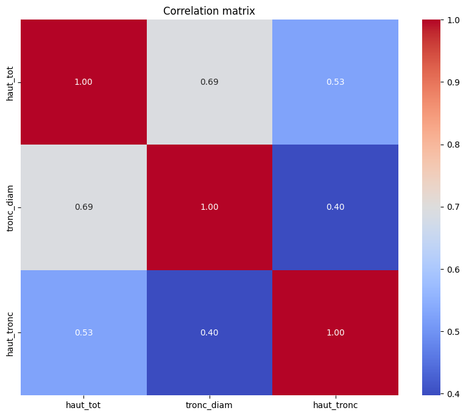
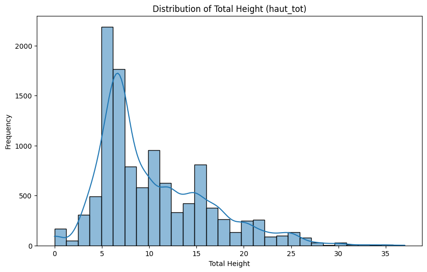
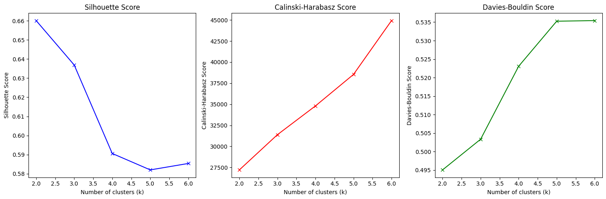

# Besoin client 1 : Visualisation des arbres sur une carte
**Marie EVANS**

---

## Contexte
Le besoin client consistait à visualiser sur une carte les arbres répertoriés dans notre fichier, segmentés par taille, tout en offrant à l'utilisateur la possibilité de choisir le nombre de catégories (niveaux de séparation).

## 1. Entraînement du modèle
### 1.1 Choix des caractéristiques 
Afin de déterminer quelles informations étaient les plus pertinentes pour segmenter les arbres, nous avons analysé leurs dimensions (hauteur du tronc, hauteur totale et diamètre du tronc). Nous avons calculé leur matrice de corrélation pour identifier les variables expliquant le mieux les caractéristiques globales de l'arbre.

La matrice de corrélation montre que la hauteur totale est la variable la plus représentative. Elle présente les scores de corrélation les plus élevés avec les autres variables : 69 % avec le diamètre du tronc et 53 % avec la hauteur du tronc.

### 1.2 Choix du modèle 
Nous avons opté pour l'algorithme K-means. Ce modèle permet de regrouper efficacement les valeurs en minimisant l'écart entre chaque point et la moyenne (centroïde) de son groupe.

#### Exemple pédagogique
Imaginons que l'on choisisse 3 clusters pour la suite de chiffres [1, 2, 3, 5, 8, 13] :On initialise trois clusters avec pour moyennes respectives k_1=1, k_2=2 et k_3=3.On associe chaque valeur au cluster dont la moyenne est la plus proche. Au premier tour, 1 va dans k_1, 2 dans k_2, et tous les autres (3, 5, 8, 13) dans k_3.La nouvelle moyenne de k_3 devient 7,25. En recalculant les distances, le chiffre 3 se rapproche alors de k_2 et change de groupe.Le processus se répète jusqu'à ce que plus aucun nombre ne change de cluster. On obtient finalement : {1, 2}, {3, 5} et {8, 13}.

Cependant, ce modèle présente un inconvénient lié à la distribution de nos données. Comme l'indique l'histogramme ci-dessous, la majorité des arbres mesure entre 5 et 10 mètres, et très peu dépassent les 25 mètres. Cela peut créer des clusters très denses et d'autres beaucoup plus clairsemés.

### 1.3 Choix du nombre de cluster
Pour définir le nombre optimal de catégories, j'ai utilisé la méthode du coude (Elbow Method). Le coude principal se situe à 2 clusters, ce qui semble être le découpage idéal. Un coude secondaire apparaît à 3 clusters, indiquant que ce choix reste pertinent. Au-delà, aucune cassure nette n'est visible, signifiant que des séparations supplémentaires n'apporteraient pas de valeur statistique réelle.

### 1.4 Métriques
- Silhouette Score : Ce score (compris entre -1 et 1) mesure la qualité de la séparation : un point doit être proche de son cluster et loin du voisin. Le score diminue après $k=2$, ce qui confirme que deux clusters sont préférables.
- Davies-Bouldin Score : Ce score doit être minimisé car il représente le rapport entre la distance intra-cluster et la distance inter-cluster. Là encore, le score le plus bas est obtenu pour $k=2$.
- Calinski-Harabasz Score : Ce score, qui doit être maximisé, semble indiquer ici que la séparation s'améliore avec le nombre de clusters. Toutefois, ce résultat est biaisé : ce score est très sensible à la dispersion et aux déséquilibres de taille entre les groupes, ce qui est précisément notre cas comme vu sur l'histogramme.

### 1.5 Transmission au script
Pour intégrer ces résultats, j'ai ajouté deux colonnes au fichier CSV final : une pour la segmentation en 2 clusters et une pour celle en 3 clusters.

## 2. Script
Le script traite les données générées par le modèle et attribue à chaque cluster une étiquette compréhensible (Petit, Moyen, Grand) selon le mode choisi.

Projection géographique : Les coordonnées ont été projetées dans le système adéquat (conversion de l'EPSG:3949 vers l'EPSG:4326) pour permettre un affichage précis sur la carte.

Interactivité : Deux cartes ont été superposées dans une interface unique. Grâce à l'ajout d'un bouton de filtrage, l'utilisateur peut basculer instantanément entre la vue à 2 clusters et la vue à 3 clusters.

# Besoin client 2 : Prédiction de l'âge des arbres
**Mathéo Bertin** — Projet Machine Learning

---

## Contexte

L'idée de ce projet est simple : on a un dataset d'arbres urbains avec des infos comme la hauteur, le diamètre du tronc ou l'espèce, et on veut prédire leur âge automatiquement. Concrètement, ça permettrait à un agent sur le terrain de prendre quelques mesures et d'obtenir une estimation sans avoir à fouiller les archives de plantation.

C'est un problème de régression supervisée, puisque la variable cible (`age_estim`) est continue.

---

## Données

Le dataset contient **11 248 arbres** et **37 colonnes**. La plupart des colonnes sont des métadonnées (identifiants, dates de saisie, infos administratives) qui ne servent à rien pour prédire l'âge. J'en ai gardé 10 qui ont un sens réel :

| Variable | Type | Pourquoi |
|---|---|---|
| `haut_tot` | Numérique | Plus un arbre est vieux, plus il est grand |
| `haut_tronc` | Numérique | Idem pour la hauteur du tronc |
| `tronc_diam` | Numérique | Indicateur classique d'âge |
| `clc_nbr_diag` | Numérique | Nombre de diagnostics |
| `fk_prec_estim` | Numérique | Précision de l'estimation |
| `clc_quartier` | Catégorielle | Peut refléter des périodes de plantation |
| `nomlatin` | Catégorielle | L'espèce influence beaucoup la croissance |
| `fk_stadedev` | Catégorielle | Stade de développement |
| `fk_arb_etat` | Catégorielle | État sanitaire |
| `fk_situation` | Catégorielle | Contexte (rue, parc…) |

Après suppression des lignes sans `age_estim`, il reste **10 415 observations**. Les valeurs manquantes dans les features sont gérées plus tard dans le pipeline.

> **Bug rencontré :** dans une première version, j'avais inclus `age_estim` dans les colonnes numériques du préprocesseur. Ça causait un `KeyError` au `fit()` parce que la colonne n'existe plus dans `X_train`. Corrigé en détectant les types de colonnes sur `X` uniquement, après avoir séparé features et cible.

---

## Prétraitement

J'ai utilisé un `ColumnTransformer` avec deux pipelines selon le type de colonne :

- **Numériques :** imputation par la médiane (plus robuste que la moyenne face aux outliers) + `StandardScaler`. La normalisation est obligatoire pour SVR et LinearRegression qui sont sensibles aux échelles.
- **Catégorielles :** imputation par la valeur la plus fréquente + `OneHotEncoder` avec `handle_unknown="ignore"` pour éviter les erreurs si le test contient des modalités inconnues.

Tout est encapsulé dans des `Pipeline` scikit-learn, ce qui garantit qu'il n'y a pas de data leakage : le préprocesseur est fitté uniquement sur le train set.

Split : **80% train** (8 332 lignes) / **20% test** (2 083 lignes), `random_state=42`.

---

## Modèles testés

J'ai comparé 4 algorithmes pour couvrir différentes approches :

- **LinearRegression** — le modèle de référence le plus simple
- **SVR** — approche par noyau, flexible mais sensible aux hyperparamètres
- **RandomForest** — ensemble par bagging, robuste et peu sensible au réglage
- **GradientBoosting** — ensemble par boosting, souvent très performant mais plus long à entraîner

Les métriques utilisées sont le **R²** (métrique principale), le **MAE** (erreur en années, facile à interpréter) et le **RMSE** (pénalise plus les grosses erreurs).

---

## Résultats

### Baseline

| Modèle | R² Test | MAE | RMSE |
|---|---|---|---|
| RandomForest | **0.9505** | **1.99** | 4.53 |
| GradientBoosting | 0.9110 | 4.20 | 6.07 |
| LinearRegression | 0.8477 | 5.58 | 7.93 |
| SVR | 0.8259 | 4.37 | 8.48 |

Le RandomForest domine déjà largement avec un R² de 0,95 et un MAE de moins de 2 ans. La LinearRegression confirme que la relation n'est pas linéaire.

### Après GridSearchCV (cv=5, scoring=R²)

| Modèle | R² Optimisé | MAE | RMSE | ΔR² |
|---|---|---|---|---|
| RandomForest | **0.9506** | **1.99** | **4.52** | +0.0002 |
| GradientBoosting | 0.9434 | 2.49 | 4.84 | +0.0324 |
| SVR | 0.9061 | 3.05 | 6.23 | +0.0802 |
| LinearRegression | 0.8477 | 5.58 | 7.93 | +0.0000 |

Le GridSearch apporte surtout pour SVR (+0,08) et GradientBoosting (+0,03). Pour le RandomForest, c'était déjà quasiment optimal avec les paramètres par défaut.

Meilleurs hyperparamètres trouvés :
- RandomForest : `n_estimators=300`, `max_depth=None`, `min_samples_split=2`
- GradientBoosting : `learning_rate=0.2`, `max_depth=7`, `n_estimators=200`
- SVR : `C=10`, `epsilon=1.0`, `kernel=rbf`

---

## Meilleur modèle — RandomForest

| | Train | Test |
|---|---|---|
| R² | 0.9932 | 0.9506 |
| MAE | 0.77 ans | 1.99 ans |
| RMSE | 1.68 ans | 4.52 ans |

L'écart de généralisation (R² train − test = 0,04) est modéré. Il y a un léger overfitting, ce qui est normal pour un RandomForest sans contrainte de profondeur, mais ça reste très acceptable. Le MAE de 1,99 an est très bon vu que les âges vont de 0 à 200 ans.

---

## Conclusion

Le RandomForest optimisé est clairement le meilleur modèle sur ce problème, avec **R²=0,95 et MAE=1,99 an** sur le test set. L'approche par ensemble capture bien les relations non-linéaires entre les features et l'âge, ce que la régression linéaire ne peut pas faire.

Ce projet m'a surtout permis de travailler sur la structuration d'un pipeline ML complet : sélection de features, prétraitement propre, comparaison de modèles et optimisation. Le modèle est sauvegardé dans `modele_arbre.pkl` et directement utilisable.

Ce que j'aurais pu améliorer : contraindre `max_depth` du RandomForest pour réduire l'overfitting, et potentiellement explorer des features supplémentaires comme les coordonnées géographiques.

# Besoin client 3 – Système d'alerte pour les tempêtes
**Padrig Perrigaud**

---

## Objectif

L'objectif est de mettre en place un modèle capable de prédire si un arbre est susceptible d'être déraciné lors d'une tempête, à partir de ses caractéristiques physiques et environnementales.

## Définition de la cible

La colonne `fk_arb_etat` contient six états distincts. La première question à résoudre était de déterminer lesquels correspondent réellement à un déracinement par tempête. Après analyse, les états *Essouché* et *Non essouché* sont les seuls qui décrivent un arbre soulevé par ses racines — phénomène directement causé par le vent. Les états *ABATTU*, *SUPPRIMÉ* et *REMPLACÉ* relèvent en principe d'interventions humaines planifiées.

Cependant, en croisant `fk_arb_etat` avec la colonne `dte_abattage`, j'ai constaté que 108 arbres classés *ABATTU* n'ont aucune date d'abattage enregistrée. L'absence de date suggère un abattage d'urgence, potentiellement consécutif à une tempête. Ces arbres ont donc été intégrés aux cas positifs.

La cible finale est binaire : `1` pour les arbres *Essouché*, *Non essouché*, et *ABATTU* sans date d'abattage (376 cas), `0` pour tous les autres (10 872 cas).

## Sélection des features

J'ai retenu uniquement les colonnes décrivant des caractéristiques physiques susceptibles d'influencer la résistance d'un arbre au vent : hauteur totale, hauteur du tronc, diamètre du tronc, âge estimé, stade de développement, port, type de pied, situation, revêtement autour du pied et feuillage. Les colonnes administratives (identifiants, dates, noms) ont été écartées. Les lignes contenant des valeurs manquantes ont été supprimées plutôt qu'imputées, pour ne pas introduire de données artificielles. Le dataset final compte 9 398 arbres.

## Choix du modèle

Le dataset est fortement déséquilibré — environ 4% de positifs contre 96% de négatifs. Pour un système d'alerte, la métrique pertinente est le **recall** : rater un arbre qui va tomber est bien plus grave que déclencher une fausse alerte. J'ai comparé quatre algorithmes en cross-validation (Logistic Regression, Random Forest, Gradient Boosting, Decision Tree).

Sans rééquilibrage, la Logistic Regression obtenait le meilleur recall (68%) alors que Random Forest ne dépassait pas 3%. Ce résultat contre-intuitif s'explique par le déséquilibre : les modèles complexes apprennent à tout prédire comme la classe majoritaire, ce qui est correct 96% du temps mais inutile pour une alerte.

## Rééquilibrage des données

Pour tirer parti des modèles non linéaires, mieux adaptés à un phénomène aussi complexe que le déracinement par tempête, j'ai appliqué une stratégie mixte sur le train uniquement : génération d'exemples synthétiques via SMOTE et réduction de la classe majoritaire par undersampling, avec un ratio cible de 60/40. Cette approche a permis à Random Forest de monter à 85% de recall en cross-validation, mais seulement 26% sur le test réel — les modèles apprenaient sur les données synthétiques sans généraliser aux vrais arbres.

En ajoutant un poids fort sur la classe minoritaire (`class_weight` jusqu'à 20x), Random Forest a atteint **91% de recall sur le test réel**, ce qui constitue le meilleur résultat obtenu.

## Résultats et choix final

Le modèle retenu est un **Random Forest** avec `class_weight={0:1, 1:20}`, optimisé par GridSearchCV (`max_depth=10`, `min_samples_split=2`, `n_estimators=100`), entraîné sur un dataset rééquilibré par SMOTE + undersampling (ratio 60/40).

Sur le test set réel (non rééquilibré), il détecte 91% des arbres à risque de déracinement, au prix d'un nombre important de fausses alertes (precision de 5%). Ce compromis est volontaire : pour une mairie, le coût d'une inspection inutile reste bien inférieur à celui d'un arbre non détecté qui tombe lors d'une tempête.

Le seuil de décision est fixé à 50% et peut être ajusté selon les besoins opérationnels — abaissé avant une tempête annoncée pour être plus prudent, relevé en période normale pour limiter les inspections.

## Limites

Les performances sont contraintes par la nature même des données : 376 cas positifs sur 11 248 arbres, sans information sur les causes exactes des abattages ni données météorologiques associées. L'intégration de données comme la vitesse et la direction du vent, ou l'état sanitaire des arbres, améliorerait significativement les résultats.