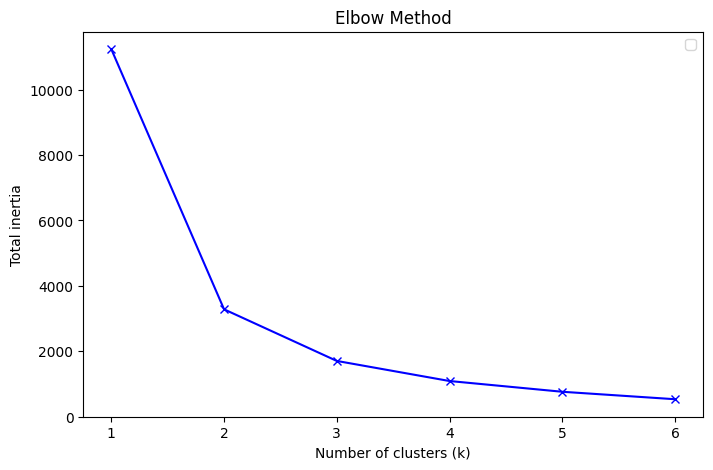

# Besoin client 1
Le besoin client consistait à visualiser sur une carte les arbres répertoriés dans notre fichier, segmentés par taille, tout en offrant à l'utilisateur la possibilité de choisir le nombre de catégories (niveaux de séparation).

## 1. Entraînement du modèle
### 1.1 Choix des caractéristiques 
Afin de déterminer quelles informations étaient les plus pertinentes pour segmenter les arbres, nous avons analysé leurs dimensions (hauteur du tronc, hauteur totale et diamètre du tronc). Nous avons calculé leur matrice de corrélation pour identifier les variables expliquant le mieux les caractéristiques globales de l'arbre.

La matrice de corrélation montre que la hauteur totale est la variable la plus représentative. Elle présente les scores de corrélation les plus élevés avec les autres variables : 69 % avec le diamètre du tronc et 53 % avec la hauteur du tronc.

### 1.2 Choix du modèle 
Nous avons opté pour l'algorithme K-means. Ce modèle permet de regrouper efficacement les valeurs en minimisant l'écart entre chaque point et la moyenne (centroïde) de son groupe.

#### Exemple pédagogique
Imaginons que l'on choisisse 3 clusters pour la suite de chiffres [1, 2, 3, 5, 8, 13] :On initialise trois clusters avec pour moyennes respectives k_1=1, k_2=2 et k_3=3.On associe chaque valeur au cluster dont la moyenne est la plus proche. Au premier tour, 1 va dans k_1, 2 dans k_2, et tous les autres (3, 5, 8, 13) dans k_3.La nouvelle moyenne de k_3 devient 7,25. En recalculant les distances, le chiffre 3 se rapproche alors de k_2 et change de groupe.Le processus se répète jusqu'à ce que plus aucun nombre ne change de cluster. On obtient finalement : {1, 2}, {3, 5} et {8, 13}.

Cependant, ce modèle présente un inconvénient lié à la distribution de nos données. Comme l'indique l'histogramme ci-dessous, la majorité des arbres mesure entre 5 et 10 mètres, et très peu dépassent les 25 mètres. Cela peut créer des clusters très denses et d'autres beaucoup plus clairsemés.

### 1.3 Choix du nombre de cluster
Pour définir le nombre optimal de catégories, j'ai utilisé la méthode du coude (Elbow Method). Le coude principal se situe à 2 clusters, ce qui semble être le découpage idéal. Un coude secondaire apparaît à 3 clusters, indiquant que ce choix reste pertinent. Au-delà, aucune cassure nette n'est visible, signifiant que des séparations supplémentaires n'apporteraient pas de valeur statistique réelle.

### 1.4 Métriques
- Silhouette Score : Ce score (compris entre -1 et 1) mesure la qualité de la séparation : un point doit être proche de son cluster et loin du voisin. Le score diminue après $k=2$, ce qui confirme que deux clusters sont préférables.
- Davies-Bouldin Score : Ce score doit être minimisé car il représente le rapport entre la distance intra-cluster et la distance inter-cluster. Là encore, le score le plus bas est obtenu pour $k=2$.
- Calinski-Harabasz Score : Ce score, qui doit être maximisé, semble indiquer ici que la séparation s'améliore avec le nombre de clusters. Toutefois, ce résultat est biaisé : ce score est très sensible à la dispersion et aux déséquilibres de taille entre les groupes, ce qui est précisément notre cas comme vu sur l'histogramme.

### 1.5 Transmission au script
Pour intégrer ces résultats, j'ai ajouté deux colonnes au fichier CSV final : une pour la segmentation en 2 clusters et une pour celle en 3 clusters.

## 2. Script
Le script traite les données générées par le modèle et attribue à chaque cluster une étiquette compréhensible (Petit, Moyen, Grand) selon le mode choisi.

Projection géographique : Les coordonnées ont été projetées dans le système adéquat (conversion de l'EPSG:3949 vers l'EPSG:4326) pour permettre un affichage précis sur la carte.

Interactivité : Deux cartes ont été superposées dans une interface unique. Grâce à l'ajout d'un bouton de filtrage, l'utilisateur peut basculer instantanément entre la vue à 2 clusters et la vue à 3 clusters.